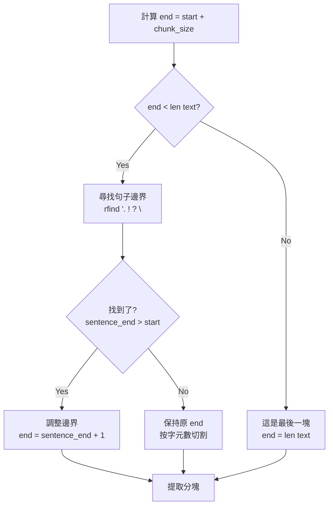
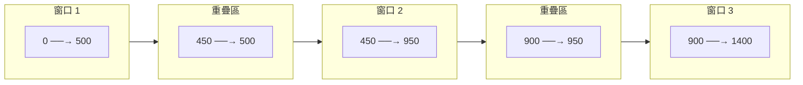

# 文本分塊邏輯詳解

## 函數簽名

```python
# document_processor.py:19
def chunk_text(self, text: str, metadata: Dict = None) -> List[Dict]:
```

## 核心概念

這個函數實現了一個 **滑動窗口（Sliding Window）** 算法，具有以下特性：

1. **固定窗口大小**：每個窗口 500 字元（chunk_size）
2. **智能邊界檢測**：優先在句子邊界切割
3. **重疊機制**：窗口之間重疊 50 字元（chunk_overlap）
4. **元數據追蹤**：記錄每個分塊的位置信息

---

## 逐行詳解

### 第 1 步：初始化

```python
chunks = []    # 儲存所有分塊的列表
start = 0      # 當前窗口的起始位置（索引）
```

**說明**：
- `chunks`：最終返回的結果
- `start`：類似「游標」，指向當前要處理的位置

---

### 第 2 步：主循環

```python
while start < len(text):
```

**循環條件**：只要還沒處理完整個文本就繼續

**示例**：
```
text = "這是一段文本..." (共 1000 字元)
start = 0    → 繼續
start = 450  → 繼續
start = 900  → 繼續
start = 1000 → 停止（已到末尾）
```

---

### 第 3 步：計算初始結束位置

```python
end = start + 500  # chunk_size = 500
```

**示例**：
```
迭代 1: start=0   → end=500
迭代 2: start=450 → end=950
迭代 3: start=900 → end=1400
```

**視覺化**：
```
[0                                          500]
 ├───────────────────────────────────────────┤
 │         第一個窗口（500 字元）              │
 └───────────────────────────────────────────┘
```

---

### 第 4 步：智能邊界檢測（核心邏輯）

```python
if end < len(text):  # 還沒到文本末尾
```

**為什麼要檢查？**
- 如果 `end >= len(text)`，表示已經是最後一塊了
- 最後一塊不需要調整邊界，直接取到末尾即可

#### 4.1 尋找句子邊界

```python
sentence_end = max(
    text.rfind('. ', start, end),   # 在 [start, end) 範圍內找最後一個 ". "
    text.rfind('! ', start, end),   # 找最後一個 "! "
    text.rfind('? ', start, end),   # 找最後一個 "? "
    text.rfind('\n', start, end)    # 找最後一個換行符
)
```

**rfind() 函數說明**：
```python
text.rfind(substring, start, end)
# 功能：從右向左查找子字符串，返回最後一次出現的索引
# 返回：找到 → 索引位置；找不到 → -1
```

**實際例子**：

```python
text = "Python is great. Machine learning is powerful. AI is the future."
#       0              17                           48                 66
#       ↑              ↑                            ↑
#      start      第一個句號                    第二個句號

start = 0
end = 50  # chunk_size = 50

# 尋找句子邊界
text.rfind('. ', 0, 50)  # 找到位置 48（"powerful." 的句號）
text.rfind('! ', 0, 50)  # 沒找到，返回 -1
text.rfind('? ', 0, 50)  # 沒找到，返回 -1
text.rfind('\n', 0, 50)  # 沒找到，返回 -1

sentence_end = max(48, -1, -1, -1) = 48
```

**為什麼用 max()？**
- 因為我們要找「最靠近 end 的」句子結束符
- max() 會選擇最大的索引（最右邊的）
- 如果都沒找到（都是 -1），max() 返回 -1

#### 4.2 調整結束位置

```python
if sentence_end > start:
    end = sentence_end + 1
```

**邏輯**：
- `sentence_end > start`：確保找到的句號在當前窗口內
- `end = sentence_end + 1`：包含句號本身（+1）

**示例**：
```python
text = "Python is great. Machine learning is powerful."
#       0              16 17                        47
#                       ↑
#                  sentence_end = 16

end = sentence_end + 1 = 17  # 包含句號
chunk = text[0:17] = "Python is great."  # ✅ 完整的句子
```

**不調整的情況**：
```python
sentence_end = -1  # 沒找到任何句子邊界
# 或
sentence_end = 5, start = 10  # sentence_end < start

# 這時保持原來的 end = start + 500
# 直接按字元數切割
```

---

### 第 5 步：提取分塊文本

```python
chunk_text = text[start:end].strip()
```

**操作**：
- `text[start:end]`：Python 切片，提取子字符串
- `.strip()`：移除首尾空白字元

**示例**：
```python
text = "  Python is great.  "
start = 0
end = 20

chunk_text = text[0:20].strip()
# = "  Python is great.  ".strip()
# = "Python is great."  # 去除了首尾空格
```

---

### 第 6 步：驗證與儲存

```python
if chunk_text:  # 確保不是空字符串
```

**為什麼需要檢查？**
- 可能整段都是空白
- 經過 strip() 後變成空字符串
- 避免儲存空的分塊

#### 6.1 複製並擴展元數據

```python
chunk_metadata = metadata.copy()
```

**為什麼要 copy()？**
```python
# 錯誤示範（不使用 copy）
chunk_metadata = metadata  # 這是引用，不是複製！

chunk_metadata['chunk_index'] = 0
# ❌ 會修改原始的 metadata！所有分塊會共享同一個 dict

# 正確示範（使用 copy）
chunk_metadata = metadata.copy()  # 創建獨立的副本

chunk_metadata['chunk_index'] = 0
# ✅ 只修改這個分塊的 metadata
```

#### 6.2 添加分塊特定信息

```python
chunk_metadata['chunk_index'] = len(chunks)      # 第幾塊（從 0 開始）
chunk_metadata['start_char'] = start             # 在原文中的起始位置
chunk_metadata['end_char'] = end                 # 在原文中的結束位置
```

**實際例子**：
```python
# 第一個分塊
{
    'chunk_index': 0,
    'start_char': 0,
    'end_char': 500,
    'filename': 'python_basics.txt',  # 從原始 metadata 複製來的
    'source': '/path/to/python_basics.txt'
}

# 第二個分塊
{
    'chunk_index': 1,
    'start_char': 450,    # 注意：與第一塊重疊（450 < 500）
    'end_char': 950,
    'filename': 'python_basics.txt',
    'source': '/path/to/python_basics.txt'
}
```

#### 6.3 添加到結果列表

```python
chunks.append({
    'text': chunk_text,
    'metadata': chunk_metadata
})
```

---

### 第 7 步：移動窗口（實現重疊）

```python
start = end - 50  # chunk_overlap = 50
```

**這是核心！實現了滑動窗口的重疊機制**

**視覺化**：
```
迭代 1:
[0                                          500]
 ├───────────────────────────────────────────┤
 │         Chunk 0 (0-500)                   │
 └───────────────────────────────────────────┘
                                         450 ← 新的 start (500-50)

迭代 2:
                                    [450                                   950]
                                     ├───────────────────────────────────────┤
                                     │         Chunk 1 (450-950)             │
                                     └───────────────────────────────────────┘
                                         ↑                              900 ← 新的 start
                                         │
                                    重疊 50 字元
```

**為什麼是 `end - 50` 而不是 `end`？**

| 公式 | 結果 | 說明 |
|------|------|------|
| `start = end` | 無重疊 | Chunk 0: [0,500], Chunk 1: [500,1000] |
| `start = end - 50` | 重疊 50 | Chunk 0: [0,500], Chunk 1: [450,950] |
| `start = end - 100` | 重疊 100 | Chunk 0: [0,500], Chunk 1: [400,900] |

---

## 完整執行流程示例

讓我們用一個真實的例子走一遍：

### 輸入數據

```python
text = """Python is a high-level programming language. It was created by Guido van Rossum.
Python emphasizes code readability. It supports multiple programming paradigms.
Python is widely used in data science."""
# 總長度：200 字元（假設）

metadata = {
    'filename': 'test.txt',
    'source': '/path/to/test.txt'
}

chunk_size = 100
chunk_overlap = 20
```

### 執行過程

#### 迭代 1

```python
# 初始狀態
start = 0
chunks = []

# 計算結束位置
end = start + 100 = 100

# 尋找句子邊界（假設）
sentence_end = text.rfind('. ', 0, 100)  # 找到位置 82（"Rossum." 的句號）
end = 82 + 1 = 83

# 提取分塊
chunk_text = text[0:83].strip()
# = "Python is a high-level programming language. It was created by Guido van Rossum."

# 添加到結果
chunks.append({
    'text': chunk_text,
    'metadata': {
        'filename': 'test.txt',
        'source': '/path/to/test.txt',
        'chunk_index': 0,
        'start_char': 0,
        'end_char': 83
    }
})

# 移動窗口
start = 83 - 20 = 63
```

**視覺化**：
```
[0                                                                      83]
 Python is a high-level programming language. It was created by Guido van Rossum.
 └─────────────────────────────────────────────────────────────────────────────┘
                                                                   63 ← 新 start
```

#### 迭代 2

```python
# 當前狀態
start = 63

# 計算結束位置
end = 63 + 100 = 163

# 尋找句子邊界（假設）
sentence_end = text.rfind('. ', 63, 163)  # 找到位置 142（"paradigms." 的句號）
end = 142 + 1 = 143

# 提取分塊
chunk_text = text[63:143].strip()
# = "van Rossum. Python emphasizes code readability. It supports multiple programming paradigms."
#    ↑________↑  ← 這部分與 Chunk 0 重疊

# 添加到結果
chunks.append({
    'text': chunk_text,
    'metadata': {
        'filename': 'test.txt',
        'source': '/path/to/test.txt',
        'chunk_index': 1,
        'start_char': 63,
        'end_char': 143
    }
})

# 移動窗口
start = 143 - 20 = 123
```

**重疊部分**：
```
Chunk 0: [0────────────────────────────────────83]
                                          [63───────────────────────────────143]  Chunk 1
                                          └─────────┘
                                          重疊 20 字元
                                          "van Rossum."
```

#### 迭代 3（最後一次）

```python
# 當前狀態
start = 123

# 計算結束位置
end = 123 + 100 = 223

# 檢查是否超出文本長度
if end >= len(text):  # 假設 len(text) = 200
    # 這是最後一塊，不需要調整邊界
    end = 200  # 直接取到末尾

# 提取分塊
chunk_text = text[123:200].strip()
# = "programming paradigms. Python is widely used in data science."

# 添加到結果
chunks.append({
    'text': chunk_text,
    'metadata': {
        'filename': 'test.txt',
        'source': '/path/to/test.txt',
        'chunk_index': 2,
        'start_char': 123,
        'end_char': 200
    }
})

# 移動窗口
start = 200 - 20 = 180

# 下次循環
while 180 < 200:  # False！循環結束
```

### 最終結果

```python
chunks = [
    {
        'text': "Python is a high-level programming language. It was created by Guido van Rossum.",
        'metadata': {'filename': 'test.txt', 'chunk_index': 0, 'start_char': 0, 'end_char': 83}
    },
    {
        'text': "van Rossum. Python emphasizes code readability. It supports multiple programming paradigms.",
        'metadata': {'filename': 'test.txt', 'chunk_index': 1, 'start_char': 63, 'end_char': 143}
    },
    {
        'text': "programming paradigms. Python is widely used in data science.",
        'metadata': {'filename': 'test.txt', 'chunk_index': 2, 'start_char': 123, 'end_char': 200}
    }
]
```

---

## 關鍵邏輯圖解

### 1. 句子邊界檢測邏輯



### 2. 滑動窗口機制



---

## 邊界情況處理

### 情況 1：文本太短

```python
text = "Short text."  # 只有 11 字元
chunk_size = 500

# 迭代 1
start = 0
end = 0 + 500 = 500

# 檢查
if end < len(text):  # 500 < 11? False!
    # 不進入句子邊界檢測

# 直接提取
chunk_text = text[0:500].strip()  # Python 自動處理越界，等同於 text[0:11]
# = "Short text."

# 移動窗口
start = 500 - 50 = 450

# 下次循環
while 450 < 11:  # False，結束

# 結果：只有 1 個分塊
```

### 情況 2：沒有句子邊界

```python
text = "PythonPythonPythonPython..." * 100  # 沒有任何標點符號

# 所有 rfind() 都返回 -1
sentence_end = max(-1, -1, -1, -1) = -1

# 不調整邊界
if sentence_end > start:  # -1 > 0? False
    # 不執行

# 保持 end = start + 500
# 結果：精確按 500 字元切割
```

### 情況 3：空白文本

```python
text = "     "  # 只有空格

# 提取
chunk_text = text[0:500].strip() = ""

# 檢查
if chunk_text:  # False!
    # 不添加到 chunks

# 結果：chunks = []（空列表）
```

---

## 性能分析

### 時間複雜度

```python
# 假設文本長度為 n，chunk_size 為 c，chunk_overlap 為 o

# 分塊數量
num_chunks = n / (c - o)  # 約等於

# 每次迭代的操作
# - rfind(): O(c)  （在 c 個字元中搜索）
# - slice: O(c)    （複製 c 個字元）
# - strip(): O(c)  （掃描 c 個字元）

# 總時間複雜度
T = num_chunks × O(c) = O(n)  # 線性時間
```

### 空間複雜度

```python
# chunks 列表
# - 每個 chunk 儲存 c 個字元
# - 有 n/c 個 chunks（不考慮重疊）
# - 總空間：O(n)

# 因為重疊，實際會多存約 10% 的數據
S = O(n × 1.1) = O(n)  # 線性空間
```

---

## 常見問題

### Q1: 為什麼句號後面要加空格？

```python
text.rfind('. ', start, end)  # 為什麼是 '. ' 而不是 '.'？
```

**答案**：避免誤判小數點或縮寫

```python
# 錯誤示範
text = "The price is $19.99. This is great."
text.find('.')  # 會找到 "19.99" 的點！

# 正確示範
text.find('. ')  # 只找句子結束的點
```

### Q2: 如果句子結束符在重疊區會怎樣?

```python
text = "First sentence. Second sentence."
#                     16 17

chunk_size = 20
chunk_overlap = 5

# Chunk 0: [0-17]  "First sentence."
# Chunk 1: [12-32] "ce. Second sentence."
#           ↑ 重疊區包含 "nce. "
```

**答案**：這是正常且有益的！
- Chunk 0 有完整的 "First sentence."
- Chunk 1 有完整的 "Second sentence."
- 即使查詢 "first" 或 "second"，都能找到完整上下文

### Q3: 為什麼用 max() 而不是找第一個？

```python
sentence_end = max(
    text.rfind('. ', start, end),
    text.rfind('! ', start, end),
    text.rfind('? ', start, end),
    text.rfind('\n', start, end)
)
```

**答案**：為了找最靠近 end 的邊界

```python
text = "First. Second. Third. Fourth"
#            5       13     20

start = 0
end = 25

# 如果用第一個
first_period = text.find('. ', 0, 25) = 5
chunk = "First."  # 太短了！

# 使用最後一個
last_period = text.rfind('. ', 0, 25) = 20
chunk = "First. Second. Third."  # 更合理！
```

---

## 總結

這個分塊算法的精妙之處在於：

1. **智能分割**：優先在句子邊界切割，保持語義完整性
2. **容錯機制**：如果找不到邊界，退化到按字元數切割
3. **重疊設計**：避免關鍵信息被切斷
4. **元數據追蹤**：可以追溯每個分塊在原文中的位置
5. **高效實現**：O(n) 時間和空間複雜度

這就是為什麼這個看似簡單的函數能夠在 RAG 系統中發揮重要作用！
