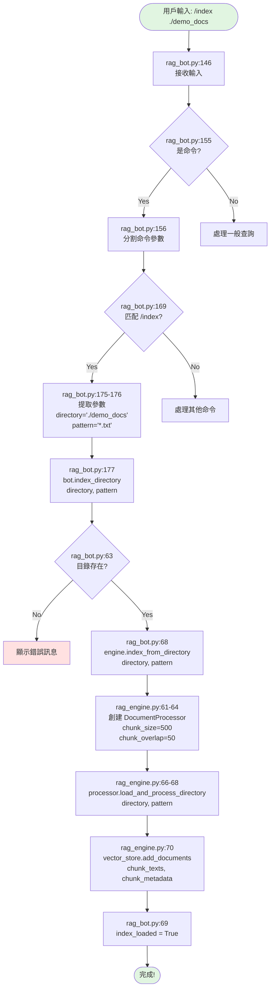
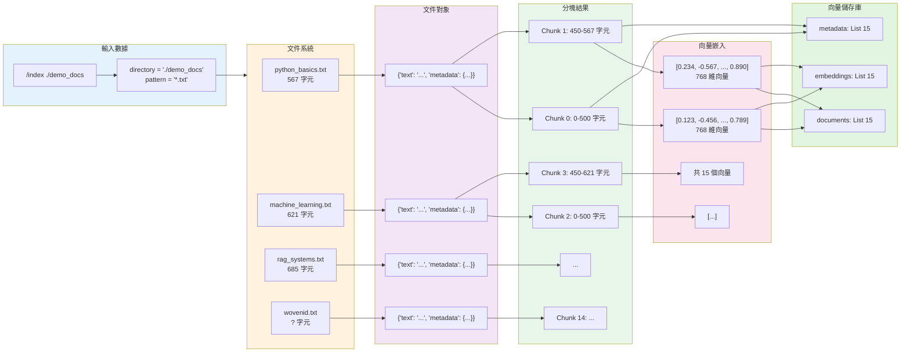
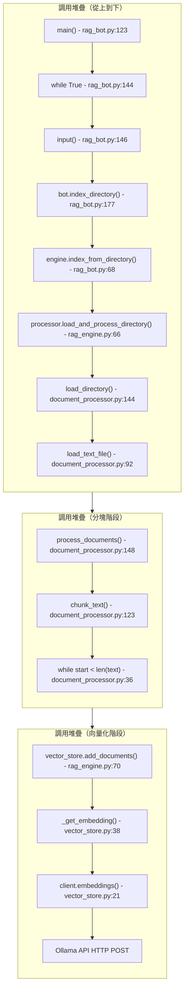
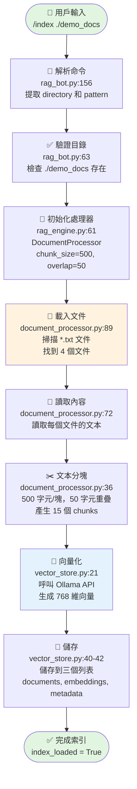

# /index 命令完整流程圖

## 主流程圖（高階視圖）



## 詳細流程圖（包含所有子流程）

```mermaid
flowchart TD
    Start([用戶輸入: /index ./demo_docs]) --> Phase1[第一階段: 命令解析]

    subgraph Phase1_Detail[第一階段: 命令解析 rag_bot.py]
        P1_1[line:146 input 接收輸入]
        P1_2[line:155 檢查 startswith'/']
        P1_3[line:156 split maxsplit=2]
        P1_4[line:169 匹配 /index]
        P1_5[line:175 directory = parts1]
        P1_6[line:176 pattern = parts2 or '*.txt']
        P1_7[line:177 呼叫 bot.index_directory]

        P1_1 --> P1_2 --> P1_3 --> P1_4 --> P1_5 --> P1_6 --> P1_7
    end

    Phase1 --> Phase2[第二階段: 目錄驗證]

    subgraph Phase2_Detail[第二階段: 目錄驗證 rag_bot.py]
        P2_1[line:61 進入 index_directory]
        P2_2[line:63 os.path.exists directory]
        P2_3{目錄存在?}
        P2_4[line:68 呼叫 engine.index_from_directory]
        P2_5[line:69 設置 index_loaded = True]

        P2_1 --> P2_2 --> P2_3
        P2_3 -->|Yes| P2_4 --> P2_5
        P2_3 -->|No| P2_Error[line:64 顯示錯誤]
    end

    Phase2 --> Phase3[第三階段: 文件處理器初始化]

    subgraph Phase3_Detail[第三階段: RAG Engine rag_engine.py]
        P3_1[line:45 進入 index_from_directory]
        P3_2[line:61-64 創建 DocumentProcessor<br/>chunk_size=500<br/>chunk_overlap=50]
        P3_3[line:66-68 呼叫<br/>processor.load_and_process_directory]
        P3_4[line:70 呼叫<br/>vector_store.add_documents]

        P3_1 --> P3_2 --> P3_3 --> P3_4
    end

    Phase3 --> Phase4[第四階段: 載入文件]

    subgraph Phase4_Detail[第四階段: 載入文件 document_processor.py]
        P4_1[line:132 進入 load_and_process_directory]
        P4_2[line:143 顯示 Loading documents...]
        P4_3[line:144 呼叫 load_directory]
        P4_4[line:75 進入 load_directory]
        P4_5[line:87 Path directory]
        P4_6[line:89 遍歷 dir_path.glob pattern]
        P4_7[line:92 呼叫 load_text_file]
        P4_8[line:70-73 讀取文件內容]
        P4_9[line:93-96 創建 metadata]
        P4_10[line:97-100 documents.append]
        P4_11[line:101 顯示 Loaded: filename]
        P4_12[line:145 顯示 Found X documents]

        P4_1 --> P4_2 --> P4_3 --> P4_4 --> P4_5 --> P4_6
        P4_6 --> P4_7 --> P4_8 --> P4_9 --> P4_10 --> P4_11
        P4_11 -->|下一個文件| P4_6
        P4_11 -->|全部完成| P4_12
    end

    Phase4 --> Phase5[第五階段: 文本分塊]

    subgraph Phase5_Detail[第五階段: 文本分塊 document_processor.py]
        P5_1[line:147 顯示 Processing documents...]
        P5_2[line:148 呼叫 process_documents]
        P5_3[line:107 進入 process_documents]
        P5_4[line:119 遍歷 documents]
        P5_5[line:123 呼叫 chunk_text]
        P5_6[line:19 進入 chunk_text]
        P5_7[line:36 while start < len text]
        P5_8[line:37 計算 end = start + 500]
        P5_9[line:40-50 尋找句子邊界]
        P5_10[line:52 提取 chunk_text]
        P5_11[line:55-58 創建 chunk_metadata]
        P5_12[line:60-63 chunks.append]
        P5_13[line:66 移動 start = end - 50]
        P5_14[line:124 all_chunks.extend]
        P5_15[line:127-128 分離 texts 和 metadata]
        P5_16[line:149 顯示 Created X chunks]

        P5_1 --> P5_2 --> P5_3 --> P5_4 --> P5_5 --> P5_6 --> P5_7
        P5_7 --> P5_8 --> P5_9 --> P5_10 --> P5_11 --> P5_12 --> P5_13
        P5_13 -->|繼續分塊| P5_7
        P5_13 -->|完成| P5_14
        P5_14 -->|下一個文件| P5_4
        P5_14 -->|全部完成| P5_15 --> P5_16
    end

    Phase5 --> Phase6[第六階段: 向量化與儲存]

    subgraph Phase6_Detail[第六階段: 向量化 vector_store.py]
        P6_1[line:30 進入 add_documents]
        P6_2[line:35 顯示 Adding X documents...]
        P6_3[line:37 遍歷 documents]
        P6_4[line:38 呼叫 _get_embedding doc]
        P6_5[line:18 進入 _get_embedding]
        P6_6[line:21-24 呼叫 Ollama API<br/>embeddings model, prompt]
        P6_7[Ollama API<br/>POST /api/embeddings]
        P6_8[line:25 返回 np.array embedding]
        P6_9[line:40 documents.append doc]
        P6_10[line:41 embeddings.append embedding]
        P6_11[line:42 metadata.append meta]
        P6_12[line:44-45 每 10 個顯示進度]
        P6_13[line:47 顯示 Added X documents]

        P6_1 --> P6_2 --> P6_3 --> P6_4 --> P6_5 --> P6_6 --> P6_7
        P6_7 --> P6_8 --> P6_9 --> P6_10 --> P6_11 --> P6_12
        P6_12 -->|下一個 chunk| P6_3
        P6_12 -->|全部完成| P6_13
    end

    Phase6 --> Complete([完成索引!])

    style Start fill:#e1f5e1
    style Complete fill:#e1f5e1
    style P2_Error fill:#ffe1e1
```



## 數據流轉圖



## 時間線圖（按執行順序）

```mermaid
gantt
    title /index ./demo_docs 執行時間線
    dateFormat X
    axisFormat %L

    section 命令解析
    接收輸入 (rag_bot.py:146)           :0, 1
    分割命令 (rag_bot.py:156)           :1, 2
    匹配命令 (rag_bot.py:169)           :2, 3
    提取參數 (rag_bot.py:175-176)       :3, 4

    section 驗證與初始化
    檢查目錄 (rag_bot.py:63)            :4, 5
    創建 DocumentProcessor (rag_engine.py:61) :5, 7

    section 載入文件
    掃描目錄 (document_processor.py:89)  :7, 10
    讀取 python_basics.txt (line:72)     :10, 15
    讀取 machine_learning.txt            :15, 20
    讀取 rag_systems.txt                 :20, 25
    讀取 wovenid.txt                     :25, 30

    section 文本分塊
    處理文件 1 (document_processor.py:123) :30, 35
    處理文件 2                            :35, 40
    處理文件 3                            :40, 45
    處理文件 4                            :45, 50
    分離文本與 metadata (line:127)        :50, 52

    section 向量化
    呼叫 Ollama API - chunk 1 (vector_store.py:21) :52, 152
    呼叫 Ollama API - chunk 2             :152, 252
    呼叫 Ollama API - chunk 3             :252, 352
    呼叫 Ollama API - chunks 4-15         :352, 1352

    section 完成
    儲存向量 (vector_store.py:40-42)     :1352, 1355
    設置 index_loaded (rag_bot.py:69)    :1355, 1356
```

## 函數調用堆疊圖



## 檔案互動圖

```mermaid
graph LR
    subgraph UserInput[用戶輸入]
        UI[/index ./demo_docs]
    end

    subgraph RagBot[rag_bot.py]
        RB1[main 123-246]
        RB2[index_directory 61-73]
    end

    subgraph RagEngine[rag_engine.py]
        RE1[index_from_directory 45-70]
    end

    subgraph DocProc[document_processor.py]
        DP1[load_and_process_directory 132-151]
        DP2[load_directory 75-105]
        DP3[load_text_file 70-73]
        DP4[process_documents 107-130]
        DP5[chunk_text 19-68]
    end

    subgraph VecStore[vector_store.py]
        VS1[add_documents 30-47]
        VS2[_get_embedding 18-28]
    end

    subgraph FileSystem[文件系統]
        FS1[demo_docs/python_basics.txt]
        FS2[demo_docs/machine_learning.txt]
        FS3[demo_docs/rag_systems.txt]
        FS4[demo_docs/wovenid.txt]
    end

    subgraph OllamaAPI[Ollama API]
        OA1[POST /api/embeddings]
    end

    UI --> RB1
    RB1 --> RB2
    RB2 --> RE1
    RE1 --> DP1
    DP1 --> DP2
    DP2 --> DP3
    DP3 --> FS1
    DP3 --> FS2
    DP3 --> FS3
    DP3 --> FS4
    DP1 --> DP4
    DP4 --> DP5
    RE1 --> VS1
    VS1 --> VS2
    VS2 --> OA1

    style UserInput fill:#e1f5e1
    style FileSystem fill:#fff3e0
    style OllamaAPI fill:#e3f2fd
```

## 簡化版流程圖（一頁視圖）



---

## 如何查看這些流程圖

這些流程圖使用 Mermaid 格式編寫，你可以通過以下方式查看：

1. **在 GitHub 上查看**：上傳到 GitHub，會自動渲染
2. **VS Code 插件**：安裝 "Markdown Preview Mermaid Support"
3. **線上編輯器**：訪問 https://mermaid.live/
4. **Obsidian**：支持原生 Mermaid 渲染
5. **Notion**：複製代碼，使用 Code block 並設置語言為 mermaid

